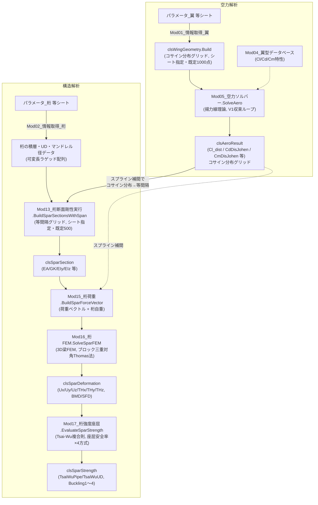

# 全体アーキテクチャ

このプログラムは大きく2段階に分かれています。

1. **空力解析** — 主翼の平面形・翼型・迎角から、揚力線理論でスパン方向の揚力・抗力分布を求める。
2. **構造解析** — その荷重を主翼の桁(スパー)が受けたときの、たわみ・ねじれ・強度・座屈余裕を求める。

「空力側で求めた荷重が、構造側の入力になる」という一方向の依存関係があるだけで、逆(構造側の変形が空力に影響する、いわゆる流体構造連成)は扱っていません。

## 全体の流れ(データフロー)



破線の矢印がスプライン補間による橋渡し(コサイン分布グリッド→等間隔グリッド)、実線が同じグリッド内でのデータの受け渡しです。

## エントリポイントは2つある

> 💻 対応コード: `Mod08_空力実行.bas` の `RunAero`、`Mod18_桁構造解析実行.bas` の `RunSparSolve` / `SolveSparFromAoa`

このプログラムには「実行ボタン」に相当するエントリポイントが2つあります。目的が違うので使い分けます。

- **`Mod08_空力実行.RunAero`** — 空力解析**だけ**を実行し、結果を「結果_空力」シートへ書き出す。目視確認・記録用。
- **`Mod18_桁構造解析実行.RunSparSolve`** — 空力解析から強度・座屈評価まで**一括**で実行する、本番用のエントリポイント。

それぞれに「迎角を1本だけ解く」版と「迎角スイープ」版があります(`Mod09_空力迎角スイープ.RunAeroSweep`/`Mod22_桁構造解析スイープ実行.RunSparSolveSweep`)。スイープ版もシートの「解析対象迎角」範囲を1本ずつ`SolveAeroFromSheet`/`SolveSparFromAoa`へ渡すだけで、内部の計算経路は単一実行と共通です。

重要なのは、`RunSparSolve`が呼ぶ`SolveSparFromAoa`は、**「結果_空力」シートを経由しない**という点です。

```vba
Public Sub SolveSparFromAoa(ByVal aoa1 As Double, ByRef geo As clsWingGeometry, _
                             ByRef sec As clsSparSection, ByRef deformation As clsSparDeformation, _
                             ByRef strength As clsSparStrength, ByRef aeroResult As clsAeroResult, _
                             Optional ByVal element As Long = 500)
    Call Mod08_空力実行.SolveAeroFromSheet(aoa1, geo, aeroResult)
    Set sec = Mod13_桁断面剛性実行.BuildSparSectionsWithSpan(geo.BSpan / 2, element)
    ...
```

`aeroResult`は呼び出し側にもByRefで返します(CSV出力(`05_構造実装編.md`§11)が空力解析結果を再利用するため)。

`SolveAeroFromSheet`は「パラメータ_翼」シートを読んで空力解析を行い、結果を`geo`(翼形状)・`aeroResult`(空力解析結果)という2つのオブジェクトとしてメモリ上に返すだけの関数です。シートへの書き出しは行いません。`SolveSparFromAoa`はこの2つのオブジェクトをメモリ上でそのまま次の断面剛性計算・荷重計算に渡していきます。

**なぜこの構成にしたか**: 元のMATLAB(`WING_IKI.m`→`WING_FEM_IKI.m`)は、空力解析の結果をいったんファイルに書き出し、構造解析側がそのファイルを読み直す、という2段階の独立したスクリプト構成でした。VBAに移植する際、`RunAero`(シートに書き出す版)はそのまま目視確認用に残しつつ、本番の一括計算では**シートの読み書きを介さずオブジェクトを直接受け渡す**ように変更しています。理由は、シート経由だと「シートに書き出す前の状態」と「シートから読み直した状態」がズレるリスク(書き出し忘れ・書き出し後の手動編集など)を排除できるためです。

## 2つのグリッド(格子点)がある

空力側と構造側では、スパン方向の分割の仕方(グリッド)が異なります。これは学習者が混乱しやすいポイントなので、明示的に説明します。

- **空力側のグリッド**: `clsWingGeometry.Build`で作られる、**コサイン分布**のグリッド(「パラメータ_翼」シートの「解析分割数」で指定、既定1000点、`Get01_翼解析分割数`経由)。翼端付近を密に、翼根付近を粗く配置する。揚力線理論(フーリエ級数展開)ではこの配置が数値的に精度が良いことが知られている(詳細は`02_空力理論編.md`)。
- **構造側のグリッド**: `Mod16_桁FEM`が扱う、**等間隔**のグリッド(「パラメータ_桁」シートの「計算分割数」で指定、既定500要素=501節点、`Get02_桁解析分割数`経由)。有限要素法(FEM)では要素を等間隔に切るのが実装上シンプルで、この程度の要素数があれば分布荷重・断面変化を十分な精度で近似できる。

この2つのグリッドの間で、空力解析の結果(Cl_dist、CdDisJohen、CmDisJohen、桁位置KetaItiなど)を**橋渡し**しているのが、`Mod15_桁荷重.bas`内のスプライン補間です。

> 💻 対応コード: `Mod15_桁荷重.bas` の `SplineAeroToFem`(Private)

コサイン分布グリッド上の点列から3次自然スプラインを作り(既存の`SplineXY_Start1`ユーティリティを利用)、それを等間隔グリッドの各節点位置で評価する、という処理です。値を単純に線形補間するのではなく3次スプラインを使っているのは、MATLAB版の`WING_FEM_IKI.m`が元々そうしているのを踏襲しているためです。

## クラスモジュールはデータの入れ物

計算の各段階の結果は、Sub/Function内のローカル変数ではなく、クラスモジュールのインスタンスとして次の段階へ受け渡されます。

| クラス | 作られる場所 | 中身 |
|---|---|---|
| `clsWingGeometry` | `Mod05`(`geo.Build`) | 翼形状: グリッド各点のY座標・翼弦長・ねじり角・桁位置・翼型名など |
| `clsAeroResult` | `Mod05`(`SolveAero`) | 空力解析結果: CL・CD、スパン方向のCl_dist/CdDisJohen/CmDisJohen分布など |
| `clsSparSection` | `Mod11`(`BuildSparSections`) | 断面剛性: 要素ごとのEA/GK/EIy/EIz/Iy/Iz/Q16など |
| `clsSparDeformation` | `Mod16`(`SolveSparFEM`) | FEM解析結果: 節点ごとのUx/Uy/Uz/THx/THy/THz、要素ごとのBMD/SFD・断面内力 |
| `clsSparStrength` | `Mod17`(`EvaluateSparStrength`) | 強度評価結果: 要素ごとのTsai-Wu比・座屈安全率×4方式 |

すべて「配列をインデックス付きPropertyで返す」という同じ設計パターンを取っています(`clsSparSection.EIy(i)`のように、要素番号`i`を指定して値を取り出す)。詳しい理論とコードの対応は`02`〜`05`で扱います。

## 単位・座標系の注意点

- 桁の断面位置は2種類のシートで単位が異なります。`Get01_桁位置`(空力側、`Mod01`)は**パーセント**(例: "35"=35%)、`Get02_桁位置`(構造側、`Mod02`)は**分数**(0〜1)で格納されています。`Mod15_桁荷重`でこれを揃える際、`/100#`の変換が必要になる点は実際に一度バグを起こした箇所なので要注意です(詳細は`07_既知の制限事項.md`)。
- UD補強材の幅(`Get02_桁UD`の該当列)はシート上ではミリメートル単位で入力されていますが、断面剛性計算(`Mod11`)はメートル単位を前提としています。`Mod13_桁断面剛性実行.ConvertUdWidthsToMeters`で変換してから渡します。

## 次に読むもの

- 空力解析の理論と実装 → `02_空力理論編.md` / `03_空力実装編.md`
- 構造解析の理論と実装 → `04_構造理論編.md` / `05_構造実装編.md`
