# 構造理論編 — 積層理論と3D梁FEM

主翼の桁(スパー)は、炭素繊維プリプレグを円管状に巻いた「パイプ」を基本構造とし、必要に応じて一方向繊維(UD)テープで局所的に補強した複合材構造です。この桁が、空力解析で求めた分布荷重(揚力・抗力・ねじりモーメント)を受けたときに、どれだけたわみ・ねじれ、どこにどれだけの応力がかかり、いつ壊れるか(強度・座屈)を求めるのが構造解析の役割です。

大学の材料力学基礎(応力・ひずみ、曲げ・せん断、有限要素法の考え方)は既知として、ここでは**複合材(積層板)固有の理論**と、**このプログラムが桁をどうモデル化しているか**に説明を絞ります。

## 1. 桁の構造モデル化(片持ち梁としての桁)

桁は「翼根で機体に固定され、翼端まで伸びる1本の梁」として扱います。翼根(付け根)を完全固定(変位・回転すべて0)、翼端まで自由、という**片持ち梁**です。梁を軸方向に等間隔の要素(「パラメータ_桁」シートの「計算分割数」で指定、既定500分割)に区切り、各要素の両端(節点)の変位・回転を未知数とする**有限要素法(FEM)** で解きます。

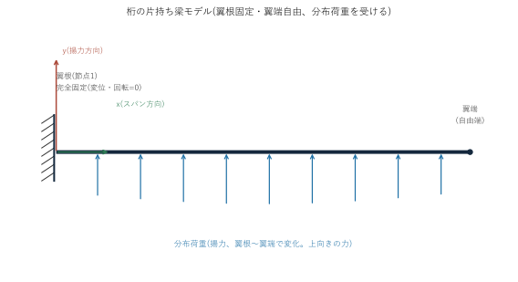

桁は等方性材料(金属など)ではなく、繊維方向を変えて何層も積み重ねた**積層複合材**でできているため、通常の材料力学の教科書に出てくる「EI」(曲げ剛性)を単純な公式では求められません。ここで**古典積層理論(Classical Laminate Theory, CLT)** が必要になります。

## 2. 古典積層理論(CLT)の基礎 — 材料主軸のQ行列とその角度変換

繊維複合材の1層(プライ)は、繊維方向(1軸)と直角方向(2軸)で剛性が大きく異なる**異方性材料**です。この1層の応力-ひずみ関係を表す剛性行列を、繊維方向を基準にした座標系で書いたものが**Q行列**(縮約剛性マトリックス)です。

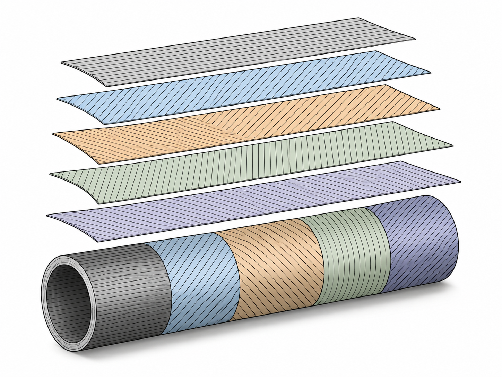

桁のパイプは、繊維の向きが異なるプライを何層も積み重ねて作られています。層ごとに繊維角度を変えることで、曲げ・ねじりに対する剛性のバランスを調整します(実際の積層構成はシートの入力データ次第で、上図は層数・角度とも説明用の例です)。

```
Q11 = Ex / (1 - νxy・νyx)
Q22 = Ey / (1 - νxy・νyx)
Q12 = νxy・Q22
Q66 = Gxy
```

(Ex, Ey: 繊維方向・直角方向のヤング率、νxy: ポアソン比、Gxy: せん断弾性率)。νyx(直角方向にひずませたときの繊維方向へのポアソン比)は独立ではなく、相反関係 νyx = νxy・Ey/Ex から求まります。

桁は円管状に、層ごとに**異なる角度**(例: 0°, ±45°, 90°など)で繊維を巻いているため、各層のQ行列を、その層の繊維角度θだけ**座標変換**する必要があります。この変換を、Q11・Q22・Q12・Q66の4つの独立成分の代わりに**5つの材料不変量U1〜U5**(角度に依存しない量)で表すと、変換後の行列(Q̄、Qバー)は次のように書けます。

```
Q̄11(θ) = U1 + U2・cos2θ + U3・cos4θ
Q̄22(θ) = U1 − U2・cos2θ + U3・cos4θ
Q̄12(θ) = U4 − U3・cos4θ
Q̄66(θ) = U5 − U3・cos4θ
Q̄16(θ) = (U2/2)・sin2θ + U3・sin4θ
Q̄26(θ) = (U2/2)・sin2θ − U3・sin4θ
```

**Q̄16・Q̄26**が、繊維角度が0°/90°以外のときに現れる項で、「面内の引張と面内せん断が連成する」ことを意味します。桁の場合、この連成が**曲げとねじりの連成**(理論編§4のQ16)として現れる、複合材特有の重要な性質です。

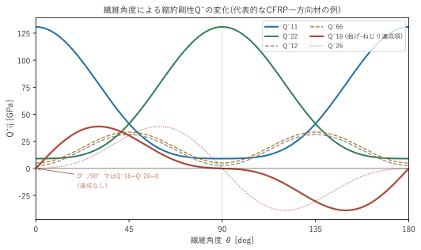

上図は代表的なCFRP一方向材の物性例でQ̄ijをθについてプロットしたものです。Q̄16(赤太線)が0°・90°ではちょうど0になり、その中間の角度で山(谷)を作ることが分かります。これが「0°/90°だけの積層なら曲げとねじりは連成しないが、±45°などの角度を混ぜると連成が生まれる」ことの直接の理由です。

## 3. 面内剛性(A行列)と等価Ex/Gxy

積層板全体としての「等価な」ヤング率・せん断弾性率は、各層のQ̄行列を**厚み比で重み付き平均**した面内剛性行列(A行列、A11, A12, A16, A22, A26, A66)から求めます。

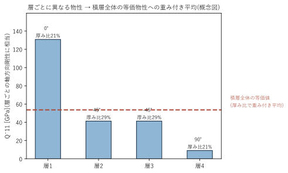

繊維角度が違えば層ごとのQ̄11(≒その方向の剛性)も大きく異なります。実際に桁の剛性計算に使うのは、この層ごとの値をそのまま使うのではなく、各層の厚みの割合で重み付き平均した「積層全体としての1つの値」です。

```
Aij = Σ (層kの厚み比) × Q̄ij(層kの角度)
```

このA行列の逆行列成分から、積層板全体の等価な軸剛性(Ex_eff)・面内せん断剛性(Gxy_eff)を求められます。この等価値は、後述のUD補強の等価物性(座屈評価で使う)や、パイプの軸剛性EA(=Ex_eff×断面積)に使われます。

## 4. 円環断面の曲げ剛性EIy/EIzと曲げ-ねじり連成Q16

桁は**円管(パイプ)断面**なので、曲げ剛性EIyは「板の曲げ剛性を円周方向に積分する」ことで求められます。各層の半径方向の境界(内側z、外側z)がわかれば、

```
EIy = Σ (2/3・Q̄11(層k)) × (z_外^4 − z_内^4)
```

という円環の直接積分公式になります(円形断面なので対称性からEIz=EIyです)。同様に、Q̄16を同じ境界で積分すると、**曲げ-ねじり連成剛性Q16**(桁を曲げたときにねじれが生じる、あるいはねじったときに曲げが生じる度合い)が求まります。これは金属材の梁には存在しない、複合材特有の項です。

> **既知の不一致(未解決)**: 円環断面をQ̄11一定の層として、y=r・sinφ、dA=r dr dφで曲げ剛性を素直に積分すると、係数は2/3ではなく**π/4**(≈0.785 vs 2/3≈0.667)になるはずです(実際、同じモジュール内の物理的な断面二次モーメント`iyPhys = pi/64*(OD⁴-ID⁴)`は、この π/4 の係数を使った標準公式そのものです)。このプログラムの`eiy3`(実際に使われているEIy)は元のMATLABコードの式をそのまま踏襲しており、独立検算でもMATLAB自身の出力とは一致することを確認済みですが、**教科書的な第一原理の積分とは約15%食い違ったまま**です。コードは変更せず、既知の制限事項として記録しています(詳細は`07_既知の制限事項.md`)。

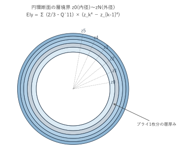

各層(z_{k-1}〜z_kの半径範囲)ごとに「その層だけが寄与する曲げ剛性」を計算して全層分を足し合わせる、という考え方です。プライを1枚ずつ「薄い円管」として積分していくイメージを持つと理解しやすくなります。

これが、このプログラムで実際に使われている剛性算出方式(元のMATLABコード内では複数の計算方式が用意されていますが、実際に使われているのはこの円環積分方式だけです)。

## 5. UD補強の扇形断面二次モーメント

パイプの局所的な強度・剛性を上げるため、パイプの外周の一部(円周角にして一定の範囲)だけに一方向繊維(UD)テープを追加で巻く設計になっています。UD部分は円周全体を覆わない**扇形(円弧状)の断面**なので、断面二次モーメントIy/Izは、単純な円環の公式ではなく、**開き角(幅/半径から決まる弧の角度)を使った扇形断面の積分公式**で計算します。UD自体の剛性(EIyへの寄与)は、この扇形断面の二次モーメントに、UD材料のヤング率を掛けて求めます。

## 6. 3D梁要素の剛性行列(6自由度/節点)

各節点は6つの自由度(軸方向変位u、揚力方向たわみv、抗力方向たわみw、ねじれ角θx、曲げ角θy、θz)を持ちます。1つの要素(隣り合う2節点)の剛性行列は、通常「12×12行列」として書かれますが、このプログラムでは**6×6のブロック4つ**(節点iから見た自分自身への影響b1、隣の節点への影響b2、隣の節点から見た自分への影響b3、隣の節点自身への影響b4)として組み立てます。

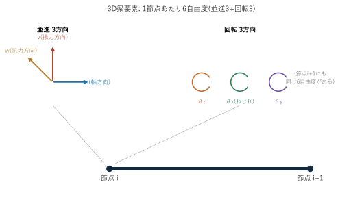

剛性の内訳は次の通りです。

- 軸力(u)は軸剛性EA
- v(揚力方向たわみ)-θz(その回転)平面の曲げは**EIy**
- w(抗力方向たわみ)-θy(その回転)平面の曲げは**EIz**
- ねじれ(θx)はねじり剛性GK
- **v/w平面の曲げとθx(ねじれ)は、§4のQ16を通じて連成**する(通常の等方性梁の剛性行列には存在しない項)

## 7. ブロック三重対角のThomas法

500要素(節点501個、自由度6×501=3006個)の連立方程式を、密な行列のまま逆行列計算で解くのは非効率です。梁の要素は「隣同士の節点しかつながらない」という構造(三重対角)を持つため、**Thomas法**(3重対角の連立方程式を、密な逆行列を作らず前進消去・後退代入だけで解くアルゴリズム)が使えます。

通常のThomas法はスカラー(1変数)の三重対角行列に使いますが、ここでは1節点に6自由度あるため、スカラーの代わりに**6×6の行列ブロック**を単位として同じ手順(前進消去・後退代入)を行う**ブロック三重対角のThomas法**を使います。これにより、3006×3006の密行列を一度も作らず、6×6の小さな行列演算(逆行列・積)を要素数程度の回数繰り返すだけで解が求まります。

## 8. 断面内の応力分布とTsai-Wu複合則

FEMで各要素の変位・断面内力(軸力・せん断力・曲げモーメント・ねじりモーメント)が求まると、断面周方向の複数の点(パイプは0°/90°/180°/270°の4点、UDは90°/270°の2点、パイプの円周4点と同じ角度基準)で、その点の応力を計算できます。梁理論の応力・ひずみの式と、§2のQ̄行列を組み合わせて、各層(プライ)の**材料主軸方向の応力**(繊維方向・直角方向・面内せん断)を求めます。

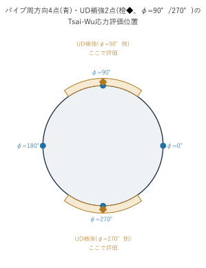

曲げ応力は断面内で位置によって符号・大きさが変わる(片側は引張、反対側は圧縮になる)ため、断面を代表するいくつかの点で評価し、そのうち最も厳しい(壊れやすい)点を採用する、という考え方です。

複合材の破壊は、繊維方向の引張・圧縮、直角方向の引張・圧縮、面内せん断がそれぞれ異なる強度を持ち、かつ**組み合わせ(相互作用)** によって早く壊れることがあるため、単純な最大応力説では不十分です。このプログラムでは**Tsai-Wu複合則**(2次の相互作用項を含む複合破壊基準)を使います。Tsai-Wu複合則そのものは、応力(σ1, σ2, σ6)に対して次の2次不等式が破壊条件になります。

```
F11σ1² + 2F12σ1σ2 + F22σ2² + F66σ6² + F1σ1 + F2σ2 = 1   (この値が1を超えたら破壊)
```

(F11, F22, F66, F1, F2は強度allowable(stx, stxd, sty, styd, sts)から決まる係数、F12は近似的にF11・F22から求める)

「現在の荷重を何倍まで大きくしたら破壊するか」という**強度比R**を求めるには、現在の応力(σ1, σ2, σ6)を**R倍したものが、ちょうど破壊条件を満たす**、という条件を立てます。つまり(σ1, σ2, σ6)を(Rσ1, Rσ2, Rσ6)に置き換えて上式に代入すると、

```
(F11σ1² + 2F12σ1σ2 + F22σ2² + F66σ6²)・R² + (F1σ1 + F2σ2)・R = 1
```

という、**Rについての2次方程式(aR² + bR = 1の形)** になります。この2次方程式を解けば、現在の応力状態が破壊条件に達するまでの倍率Rが求まります。

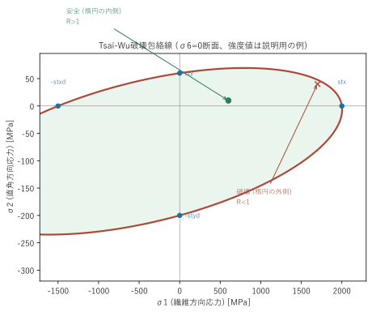

σ6(面内せん断応力)=0の断面で見ると、破壊条件は上図のような閉じた曲線(概ね楕円)になります。曲線の内側にある応力状態は安全(強度比R>1)、外側は既に破壊している(R<1)という意味です。楕円が原点を中心とせず引張側・圧縮側で非対称なのは、繊維方向・直角方向それぞれで引張強度と圧縮強度が異なるためです。

1要素につき、断面周方向×各層の全組み合わせのうち**最小の強度比**(=最も先に壊れる箇所)を、その要素の代表値として採用します。

## 9. 座屈に対する安全率(4方式)

薄肉円筒(パイプ)は、強度上は壊れなくても、曲げ荷重によって局所的に「座屈」(断面が潰れるような不安定変形)を起こすことがあります。座屈が起きる限界応力(座屈応力)は、円筒の半径・板厚・材料剛性から古典的な円筒座屈の式で概算できます。

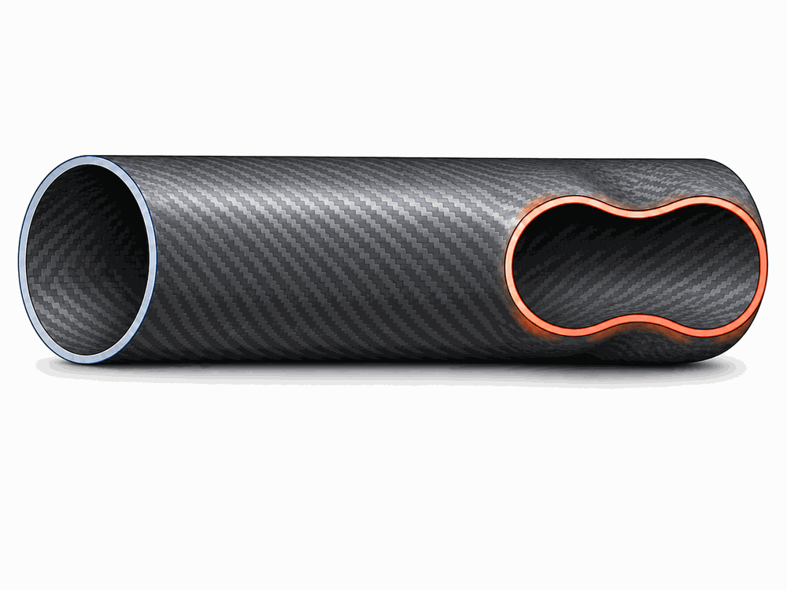

健全な断面(左端、真円)に対して、座屈が始まった箇所(右端)は断面が真円から潰れて変形します。強度(Tsai-Wu複合則)とは別に、この座屈に対する余裕も評価する必要があります。

```
座屈応力 ∝ √(Ex・Ey) / (1 − νxy²・Ey/Ex) × (板厚 / 直径)
```

このプログラムでは、**どの材料物性を使うか**(パイプ最外層1枚だけの実物性 vs 積層全体の等価物性)と、**どの厚みを使うか**(パイプだけ vs パイプ+UD補強)の組み合わせで**4通り**の座屈応力を計算し、それぞれを実際にかかる最大曲げ応力で割って安全率としています。どの方式が最も現実に近いかは設計判断の範疇であるため、4方式すべてを並べて出力する構成になっています。

「積層全体の等価物性」は、座屈評価では**Ex_eff・Ey_eff**の組を使います(§3のA行列の逆行列成分から、Ex_effと同じ要領でEy_effも同様に求められます)。これはEA計算に使うEx_eff・Gxy_eff(§3)とは**別に**A行列から導出する組で、座屈の式が√(Ex・Ey)の形を要求するために必要になります。

## 10. ワイヤー機の桁支持 — 1次不静定構造とたわみ適合法

ここまでは「翼根で完全固定・翼端は自由」という**片持ち機**を前提にしてきました。ワイヤー機は、これに加えて、桁の途中の1点(翼根からスパン方向に距離xWireの位置)から、胴体下部の固定点(アンカー)まで、引張力のみを負担できる**ワイヤー(ケーブル)** を1本張って桁を支える構造です。

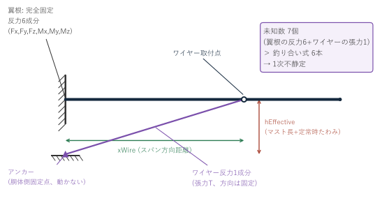

翼根の完全固定は6つの反力成分(Fx, Fy, Fz, Mx, My, Mz)を生みます。ここにワイヤーの反力(張力T、方向はアンカーの位置で決まる固定方向)が1つ加わるため、**未知数は7個**になります。ところが3次元の力・モーメントの釣り合い式は6本しかありません。つまり、**力の釣り合いだけでは解けない「1次不静定」構造**になります(理論編§7のブロックThomas法ソルバーは、翼根完全固定・翼端自由の片持ち梁専用に組まれており、この追加支点をそのまま扱う仕組みを持っていません)。

### たわみ適合法(force method)

1次不静定構造を解く古典的な方法の一つが、**たわみ適合法**(force method、変位適合法とも呼ばれる、構造力学における重ね合わせの原理の応用)です。考え方はシンプルで、「ワイヤーを1本、仮に切り離してみる」ことで、構造をいったん(片持ち機と同じ)**静定**構造に戻し、切り離した箇所の変位を手がかりに、本来そこにあるはずの反力(ワイヤー張力T)を逆算します。

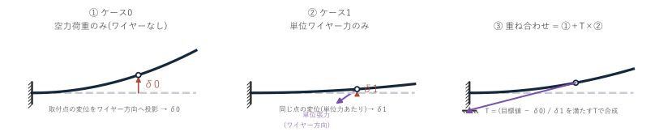

1. **ケース0**: ワイヤーを切り離した状態(=通常の片持ち機と全く同じ)で、実際の空力荷重・自重をかけて解く。ワイヤー取付点の変位を、ワイヤーの方向に投影した値を**δ0**とする。
2. **ケース1**: 同じ片持ち梁(荷重なし)に、ワイヤー取付点だけへ、ワイヤー方向に沿った**単位張力(1N)** をかけて解く。同じ点の、同じ方向への変位を**δ1**とする(単位張力あたりの変位=柔性係数)。
3. **適合条件**: ワイヤーは伸びない(剛体)とみなすため、実際の構造での変位は、ケース0とケース1×Tの重ね合わせで、ワイヤー方向にはある決まった値(後述)にならなければならない。この条件からTを逆算する。
4. **重ね合わせ**: 桁全体の最終的な変形・内力(曲げモーメント・せん断力・軸力など)は「ケース0の結果 + T×ケース1の結果」(この構造が線形弾性である限り、単純な足し算で求まる)。

### 適合条件の目標値 — なぜ「変位ゼロ」ではないか

ワイヤーの長さは、**設計上の定常飛行状態**(桁が空力荷重で上向きにたわみ、ワイヤー取付点が未変形位置から距離δ(steadyDeflection)だけ持ち上がった状態)で、ちょうどアンカーとの間で張った状態になるよう決めます。つまり、「ワイヤー取付点が未変形位置に対して全く動かない」のではなく、「δだけ動いたところで初めてワイヤーが利き始める」という設計です。

これを線形化して式にすると、ワイヤー方向単位ベクトルを(ux, uy)として、適合条件は

```
δ0 + T・δ1 = δ・uy
```

(右辺は「設計上の変位(0, δ)」をワイヤー方向へ投影した値)となり、

```
T = (δ・uy − δ0) / δ1
```

でTが求まります。桁の軸方向変位(スパン方向、Ux)は曲げ変位(Uy)に比べて元々ごくわずか(軸剛性EAは曲げ剛性EIに比べて非常に大きいため)なので、この式は実質的に「取付点の実際のたわみUyが、指定したδに近づく」という条件になります。δ=0(つまり目標値をゼロ)とする単純化は、これの特殊ケースにすぎません。

### なぜ「垂直力÷sinθ」の単純な静定計算では不十分か

「ワイヤー取付点から外側の荷重を、ワイヤーが100%肩代わりする(その点を単純支持とみなす)」と仮定すれば、その位置のせん断力Fyを使い`T = Fy / sinθ`という単純な式で張力を求められます(静定問題になります)。しかしこれは、翼根がピン(モーメントを負担しない)であるときにしか厳密には成り立ちません。翼根が完全固定である限り、**桁自身の曲げ剛性が外側の荷重の一部を分担し続ける**ため、この単純な式は張力を過大に見積もります。たわみ適合法は、桁の実際の曲げ剛性(ケース1で計算するδ1に反映される)を通じて、この分担分を正しく考慮に入れます。

### ワイヤー張力の分解 — 桁の軸方向圧縮

求めたワイヤー張力Tは、ワイヤーの角度θ(tanθ = hEffective / xWire、hEffectiveはワイヤー取付点からアンカーまでの実効高さ)を使って、

```
桁の軸方向(スパン方向)の圧縮成分 = T・cosθ
桁に対して垂直な方向(揚力を支える)の成分 = T・sinθ
```

に分解できます。軸方向の圧縮成分は、桁の**座屈**(理論編§9)に直結する重要な値です。θが小さい(ワイヤーがほぼ水平)ほど、同じ垂直支持力を得るために必要な張力が急増し、それに比例して軸圧縮も急増します(sinθが小さいほどT=…/sinθ的に効いてくるため)。ワイヤー取付位置・アンカー位置(角度)の設計は、この垂直支持効果と軸圧縮のトレードオフになります。

## 11. ワイヤー機の内側区間 — 圧縮と曲げの相互作用

ワイヤー取付点より内側(翼根〜取付点)の桁は、揚力による曲げに加えて、ワイヤー張力の軸方向成分(§10の`T・cosθ`)による**圧縮**を受けます。この区間で起きることは、実は3つの別々の現象に分けて考える必要があります。

1. **軸圧縮が応力として足される**: 圧縮による軸応力が曲げ応力に重なり、Tsai-Wu強度比・局部座屈の評価に効きます。
2. **曲げが増幅される(beam-column効果 / P-Δ効果)**: すでにたわんでいる梁に軸圧縮がかかると、そのたわみ量×圧縮力の分だけ**追加の曲げモーメント**が生まれ、さらにたわむ、という二次的な効果が生じます。
3. **区間全体が柱として座屈する(オイラー座屈)**: 理論編§9で扱った座屈は、円筒の断面が局所的に潰れる「**局部**座屈」です。これとは別に、内側区間が1本の圧縮材(柱)として横に飛び出す「**全体**座屈」があり、これは全く別の破壊モードです。

### オイラー座屈と曲げ増幅の概算

全体座屈の限界荷重(オイラー座屈荷重)と、圧縮による曲げの増幅率は次の式で概算できます。

```
Pcr = π²・EI / (k・L)²          … オイラー座屈荷重
曲げ増幅率 = 1 / (1 − P/Pcr)    … モーメント増幅法
```

Lは内側区間の長さ(=ワイヤー取付位置xWire)、Pは区間にかかる圧縮軸力、kは有効座屈長係数です。翼根は完全固定、ワイヤー取付点はワイヤー方向のみ拘束されるため、kは厳密には**両端ピン(k=1.0)と固定-ピン(k=0.7)の間**になります。EIは区間内で大きくテーパーするため、安全側に最小EIを使います。

`P/Pcr`が1に近づくほど増幅率は急激に大きくなり、1を超えると全体座屈します。逆に`P/Pcr`が十分小さければ(目安として0.1以下)、二次効果は数%程度で無視できます。

### 人力飛行機では特に注意が必要

一般の航空機構造では、ストラット/ワイヤー支持翼の内側桁をbeam-column(圧縮+曲げの相互作用)として扱うのは標準的な手順です。人力飛行機の場合はさらに事情が厳しく、Cruz & Drela(*Structural Design Conditions for Human Powered Aircraft*, OSTIV 1989、Daedalusの設計者ら)は次の点を指摘しています。

- 人力機の構造は大きく柔軟なため、**通常の航空機では無視される二次荷重が支配的になる**
- 人力機の破壊は突然かつ破局的で、**全体座屈と局部座屈の両方**が主要な破壊モードである
- **剛体仮定は使えず、構造変形を考慮した解析が必要**である

また、ワイヤーは引張しか負担できないため、**負のG・突風の谷・地上での取り回しではワイヤーが緩んで無効化され、純粋な片持ち機に戻ります**。このときの翼根曲げは大幅に増えるので、ワイヤー機として設計する場合でも「ワイヤーなし」の状態が成立しているかを必ず併せて確認する必要があります(本プログラムでは「ワイヤーをつける」をNOにして実行すればこの状態を評価できます)。

なお、現在のFEM(`Mod16_桁FEM`)は線形弾性・小変形の枠組みで、幾何剛性行列を持たないため、上記2番目の**曲げ増幅は解析結果そのものには反映されていません**。3番目の全体座屈も含め、上式による概算値を出力に添えることで確認する形にしています(実装は`05_構造実装編.md`§12を参照)。

## 次に読むもの

これらの理論が実際のVBAコード(`Mod10`〜`Mod18`、`Mod23`)のどこにどう対応しているかは、`05_構造実装編.md`で説明します。
