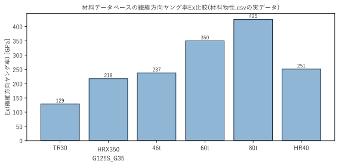

# 構造実装編 — `04_構造理論編.md` のVBA実装

`04_構造理論編.md`で説明した積層理論・3D梁FEM・強度評価の各要素が、実際のVBAコードのどこに対応するかをまとめます。各節の見出しは、コード側の`' ●学習資料:`アンカーコメントと対応しています。

## 1. 材料データベース

> 💻 対応コード: `Mod10_材料データベース.bas`

積層計算(理論編§2)に使う材料物性(Ex, Ey, G, ν, 強度allowable5値)を、「材料データベース\材料物性.csv」から読み込み、材料名(またはシート上で使われている「材料コード」、`GetMaterialPropsByCode`経由)からルックアップできるようにするモジュールです。空力側の翼型データベース(`Mod04_翼型データベース`)と同じ「遅延読み込み+辞書キャッシュ」の設計を踏襲しています。



登録されている6種類の材料は繊維方向ヤング率Exが3倍近く異なります。桁のどの位置にどの材料を使うかは、剛性・強度・重量のトレードオフを踏まえたシート側の入力(積層構成)で決まります。

## 2. 積層構成のデータ表現とbreakpoint展開

> 💻 対応コード: `Mod11_桁断面剛性.bas` の `FindSparRow`/`RampLookup`

桁のマンドレル内径・積層構成(角度・厚さ・材料)・UD補強は、桁上のいくつかの代表点(breakpoint)でのみ値が与えられ、それ以外の位置はそこから展開して求めます。この展開には2種類あります。

- **ステップ関数展開**(`FindSparRow`): 積層角度・厚さ・材料・UD構成は、代表点の値を「その代表点までの区間」にそのまま一定値として適用する。プライ構成は物理的に途中で連続変化しないため、線形補間ではなく階段状の展開が正しい。
- **ランプ(線形)展開**(`RampLookup`): マンドレル内径は、区間ごとに「開始値→終了値」へ線形に変化する。桁の継ぎ目では段付きに一定、最終区間だけ滑らかにテーパーする設計になっている。

どちらも、代表点を先頭から順に処理して**後の代表点が先の代表点を上書きする**(同じ位置に複数の代表点が重なる場合は後の行が勝つ)という、元のMATLABコードの`bunpu`関数の仕様をそのまま再現しています。

## 3. CLT計算の実装(Q行列〜EIy〜Q16)

> 💻 対応コード: `Mod11_桁断面剛性.bas` の `BuildSparSections`(材料不変量u1〜u5からQ̄行列を求める箇所、A行列を組み立てる箇所、EIy3/Q16を円環積分する箇所)

理論編§2の材料不変量U1〜U5とQ̄行列の角度変換は、

```vba
u1 = 0.125 * (3 * qxx + 3 * qyy + 2 * qxy + 4 * qss)
...
q11(j) = u1 + u2 * Cos(2 * t) + u3 * Cos(4 * t)
q16(j) = u2 * 0.5 * Sin(2 * t) + u3 * Sin(4 * t)
```

にそのまま対応します(変数名は`u1`〜`u5`、`q11`〜`q66`と理論編の記号を踏襲しています。Q̄が繊維角度でどう変化するかの図は`04_構造理論編.md`§2、円環断面の層境界による積分イメージは同§4を参照)。理論編§3のA行列(厚み比重み付き平均)は、

```vba
Dim w As Double: w = thickMm(j) / ehMm
a11 = a11 + w * q11(j)
```

のループで組み立て、その逆行列成分から`exEff`(等価Ex)・`gxyEff`(等価Gxy)を求めます。理論編§4の円環積分によるEIy・Q16は、

```vba
eiy3 = eiy3 + (2 / 3 * q11(j)) * (z2(j) ^ 4 - z2(j - 1) ^ 4)
q16Coupling = q16Coupling + pi / 4 * q16(j) * (z2(j) ^ 4 - z2(j - 1) ^ 4)
```

に対応します(`z2(j)`が層境界の半径)。元のMATLABにはEIyの算出方式が複数用意されていますが、実際に使われているのはこの円環積分方式(`analysis_type_EIy = 3`)だけなので、他の方式はVBA化していません。

## 4. UD補強断面二次モーメントの実装

> 💻 対応コード: `Mod11_桁断面剛性.bas` の `BuildSparSections`(`iyUD`/`izUD`を計算するループ)

理論編§5の扇形断面二次モーメントは、UDの各層(パイプ外周に巻き足す1層ずつ)ごとに、開き角`sita = widths(j) / rIn`を使って計算します。

```vba
sita = widths(j) / rIn
iyUD = iyUD + 0.25 * (rOut ^ 4 - rIn ^ 4) * 2 * (-Cos(pi / 2 + sita / 2) + Cos(pi / 2 - sita / 2) + ...)
```

UDの断面積(`areaUD`、自重計算用)・剛性への寄与(`exUD * iyUD`をEIyに加算)もこのブロックでまとめて計算し、`clsSparSection`(断面剛性の入れ物、要素ごとにEA/GK/EIy/EIz/Q16などをプロパティで保持)へ格納します。

## 5. 断面剛性計算の実行エントリポイント

> 💻 対応コード: `Mod13_桁断面剛性実行.bas`

「パラメータ_桁」系シートの実データを`Mod11_桁断面剛性.BuildSparSections`が期待する引数の形へ整え、呼び出すためのエントリポイントです。シート上のUD幅がミリメートル単位で入力されているのに対し`BuildSparSections`はメートル単位を前提としているため、`ConvertUdWidthsToMeters`で変換してから渡します(`01_全体アーキテクチャ.md`の単位注意点を参照)。

## 6. 桁自重

> 💻 対応コード: `Mod14_桁自重.bas`

パイプ・UDそれぞれの断面積(`clsSparSection.Area`/`AreaUD`)に材料密度(固定値1550kgf/m³)と要素長を掛けて各要素の重量を求め、隣接要素の平均を取って**節点**の自重荷重[N]に変換します(`BuildSparWeightNodes`)。この節点荷重は、`Mod15_桁荷重`が組み立てる荷重ベクトルのうち揚力方向(fy)から差し引かれます。

## 7. 荷重ベクトルの組み立てとグリッド橋渡し

> 💻 対応コード: `Mod15_桁荷重.bas` の `SplineAeroToFem`(グリッド橋渡し)、`BuildSparForceVector`(荷重ベクトル組み立て)

`01_全体アーキテクチャ.md`で説明した「コサイン分布グリッド→等間隔グリッド」の橋渡しは、`SplineAeroToFem`が担当します。ユーザーが別途実装済みの3次自然スプライン関数`SplineXY_Start1`を使い、空力側の半スパン分布(揚力係数Cl_dist・形状抗力係数CdDisJohen・誘導抗力係数CdInd・モーメント係数CmDisJohen・桁位置KetaIti)をFEM側の等間隔グリッドへ変換します。

```vba
Dim splined As Variant: splined = SplineXY_Start1(yHalf, valHalf, element)
```

`BuildSparForceVector`は、変換後の分布に動圧・面積分担(`dsFemDis`、翼弦長の台形則)を掛けて揚力・抗力・モーメントの節点荷重を求め、そこから桁自重(§6)・二次部材重量(リブ・外皮などの概算、`wps`係数×翼面積分布)を差し引いて、最終的な荷重ベクトル(節点ごとに[fy, fz, mx]、6自由度中3つ)を組み立てます。

```vba
fy = liftFem(i) * G_ACCEL - wSecondary - wNode(i)   ' 揚力 - 二次部材重量 - 桁自重
```

桁位置(KetaIti)は空力側シートがパーセント表記(例: 35=35%)で保持しているため、`/ 100#`で分率化してから圧力中心Cp(0〜1)と揃えて使います。この単位を揃え忘れるとねじりモーメントが2桁ずれて暴走する、という実機テストで見つかった不具合があった箇所です(詳細は`07_既知の制限事項.md`)。

## 8. 3D梁FEMの組立・ブロックThomas法による求解

> 💻 対応コード: `Mod16_桁FEM.bas` の `BuildElementBlocks`(要素剛性行列)、`SolveSparFEM`(組立・求解)

理論編§6の6×6ブロック(b1〜b4)は`BuildElementBlocks`で組み立てます。EIy系列(v-θz平面)の項は`c1`〜`c4`、EIz系列(w-θy平面)の項は`bigC1`〜`bigC4`、GK(ねじり)は`kG`、Q16(曲げ-ねじり連成)は`qL = q / L`として、各ブロックの該当するマス目に配置しています。

理論編§7のブロックThomas法は`SolveSparFEM`内で、まず各要素のブロックを隣接要素同士で足し合わせてブロック三重対角行列(`D`=対角ブロック、`U`=上側、`Lm`=下側)を組み立て、

```vba
' ---- 前進消去 ----
Dp(ip) = Mat6Sub(D(ip), MMult(factor, U(ip - 1)))
...
' ---- 後退代入 ----
Xsol(ip) = MMult(MInverse(Dp(ip)), rhs)
```

という手順で解きます。VBAでReDimしただけのVariant配列は要素が`Empty`(数値の0ではない)のままになり、これを`MInverse`/`MMult`に渡すとエラーになるため、`ZeroMat6`/`ZeroVec6`という明示的なゼロ初期化関数を必ず経由する点に注意してください(実際にこの問題で最初の実行時エラーが起きた箇所です)。

求解後、節点変位から要素ごとの断面内力(Cベクトル、`b1・u_i + b2・u_(i+1)`等)を計算し、揚力方向のBMD(曲げモーメント分布)・SFD(せん断力分布)、および強度評価(§9)で使う全断面内力(Fx/Fy/Fz/MxInt/MyInt/MzInt)を`clsSparDeformation`へ格納します。

## 9. 強度・座屈評価の実装

> 💻 対応コード: `Mod17_桁強度座屈.bas`

理論編§8のTsai-Wu複合則は`TsaiWuRatio`(2次方程式`a・R²+b・R=1`を解く部分)、材料主軸への応力回転は`RotateToMaterialAxes`が担当します。`EvaluateSparStrength`本体では、FEMで求めた断面内力・変位差(ひずみ)から、断面周方向の各点・各層の応力を計算し、(周方向の評価点位置・破壊包絡線の図は`04_構造理論編.md`§8を参照)

```vba
ratio = TsaiWuRatio(sigmaX, sigmaY, sigmaS, stx(j), stxd(j), sty(j), styd(j), sts(j))
If ratio < minRatioPipe Then minRatioPipe = ratio
```

のように最小強度比を要素ごとに求めます(パイプは周方向4点、UDは2点)。

理論編§9の座屈4方式は、`zakutu1`〜`zakutu4`として計算されます。

```vba
zakutu1 = 4 * 2^0.5 / 9 * (yex1*yey1)^0.5 / (1 - rmux1^2*yey1/yex1) * laminateThickM / odI
zakutu3 = 4 * 2^0.5 / 9 * (exEff*eyEff)^0.5 / (1 - rmux1^2*eyEff/exEff) * laminateThickM / odI
```

`yex1`/`yey1`(パイプ最外層の実物性)と`exEff`/`eyEff`(§3のA行列由来の等価物性)、`laminateThickM`(パイプ厚のみ)と`laminateThickM + udTotalThickM`(パイプ+UD厚)の組み合わせで4通りを計算し、実際の最大曲げ応力`sig1Max`で割って安全率にしています。

## 10. 構造解析パイプライン全体のエントリポイント

> 💻 対応コード: `Mod18_桁構造解析実行.bas` の `SolveSparFromAoa`/`RunSparSolve`

`01_全体アーキテクチャ.md`で説明した通り、`SolveSparFromAoa`が空力解析(`Mod08`)→断面剛性(`Mod13`→`Mod11`)→荷重ベクトル(`Mod15`)→FEM求解(`Mod16`)→強度評価(`Mod17`)を、シートの読み書きを介さずメモリ上のオブジェクトで一気通貫に実行する、構造解析側の唯一の入口です。`RunSparSolve`はこれを「パラメータ設定」シートの取付角で1回実行し、結果の抜粋をイミディエイトウィンドウへ出力する、目視確認用のラッパーです。
