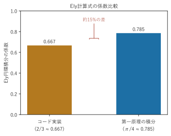

# 既知の制限事項

このドキュメントは、`02`〜`05`で説明した理論・実装のうち、**まだ完全に検証しきれていない部分**をまとめたセーフティネットです。「理論編・実装編に書いてあるから正しいはずだ」と信じ込まず、疑わしい結果が出たときはまずここを確認してください。

## 1. ねじれ角(THx)が旧ゴールデンマスターと約2.9倍ズレたまま未解決

**症状**: 翼端のねじれ角`deformation.THx(deformation.Element + 1)`の値が、過去に保存された参照データ(`keta,aoa=7.csv`)のTHx列と比べて、約2.87倍ズレている(他の出力は高精度で一致しているのに、THxだけがズレる)。

**これまでに確認して「原因ではない」と分かっていること**(すべて実データ・Python独立実装との突き合わせで確認済み):

- 断面剛性(`Mod11_桁断面剛性`)のQ16(曲げ-ねじり連成剛性)の式は、元のMATLABコードと文字単位で照合済み、転記ミスはない
- GK(ねじり剛性)は参照CSVと相対誤差1e-9以下で一致
- ねじりモーメント(Mx)は、荷重ベクトル組み立て(`Mod15_桁荷重`)の時点で参照CSVのMG列と3点で有効数字5〜6桁一致
- FEMの求解方式(ブロックThomas法)を、密行列を直接逆行列で解く方式に置き換えても、結果は完全に一致(ブロックThomas法自体の実装ミスではない)
- Q16の符号・スケールを-20倍〜+50倍の範囲で人為的に振っても、参照値に収束する係数が見当たらない(単純な符号ミス・単位ミスでは説明できない)
- 桁自重(`weight_main_spar`)は参照CSVと完全一致
- 翼端たわみUzは参照CSVと約0.2%の差で一致(BMD/SFD/Uyも同様に高精度)

**現在の状況**: 上記のように、ねじれ角の計算に関与するほぼすべての要素(剛性・荷重・求解方式)を個別に検証したが、THxだけがズレる理由は特定できていません。プロジェクトオーナー(ユーザー)の判断により、**この調査は打ち切り**、他の出力(たわみ・曲げモーメント・せん断力・強度・座屈評価、いずれも構造設計上重要な量)の検証結果をもって構造解析パイプラインの完成としています。

**注意点**: 桁の**ねじれ角**そのものを設計判断に使う場合は、この既知の精度差を踏まえて割り引いて評価するか、別途検証してから使ってください。ねじれ角以外の出力(たわみ・BMD・SFD・強度比・座屈安全率)は高精度で検証済みです。

**追記(2026-08、CSV出力機能の実データ突き合わせで再確認)**: `Mod21_桁結果CSV出力`のCSV出力を元MATLABの実データ(`keta,aoa=X.csv`)と突き合わせた際、`THx`列そのものに加えて、`THx`から求まる歪(`eps6Beam = r・dTHx`)を経由する**`sig6_beam`・`sig6_plate`(せん断応力の生値表示列)も同じ傾向でズレる**ことを確認した。翼根〜中央部で顕著、翼端付近ではむしろ元とよく一致する、という濃淡もTHx自体の傾向と一致しており、これは新しい不具合ではなく本項で既に調査・凍結されている問題の別の現れ方だと判断できる。実際の強度判定に使う`TsaiWuPipe`/`TsaiWuUD`/`Buckling1〜4`/`sig1_max`/`sig1_plate`系はいずれも元とよく一致しており、この問題の影響を受けていないことも確認済み(`sig6_plate`はTsai-Wu比の計算に加算されてはいるが、寄与が小さいためか安全率側には目立った影響が出ていない)。

## 2. 元MATLABの未使用出力列(str1/str1_UD)は実装していない

元のMATLABコード(`WING_FEM_IKI.m`)には、CSV出力に`str1`/`str1_UD`という列がありますが、ソースコード全体を検索しても代入されている箇所が見つからず、配列の初期値(0)のまま出力されている、つまり**元コードの時点で常に0の未使用列**であることを確認しています(実データでも常に0.000000)。このプログラムではこの列を再現していません(`Mod17_桁強度座屈.bas`のコメント参照)。

## 3. EipK(せん断応力sig6_Mx)は強度評価には使われていない(CSV診断出力でのみ使用)

`clsSparSection.EipK`(断面二次極モーメント相当)は、ねじりによるせん断応力`sig6_Mx = Mx・r / EipK`を計算するために元のMATLABコードにも存在する値ですが、元コードでもこの`sig6_Mx`は最終的な`sig6_plate`(Tsai-Wu複合則に使う面内せん断応力)には**足し込まれていません**。つまり元コードの時点で「計算されるが使われない」値です。強度評価(`Mod17_桁強度座屈.EvaluateSparStrength`)では、このプログラムでも同じ挙動を再現するため`EipK`を参照していません。バグではなく、元コードの仕様をそのまま踏襲した結果です。

(2026-08追記) CSV出力機能(`Mod21_桁結果CSV出力`)の診断用列`sig1_beam`/`sig6_beam`(元MATLABの`output_FEM_analyze_data.csv`にある梁理論の生値表示、Tsai-Wu評価には使われない別系統の値)は、元コードの式`sig6_beam=sig6_fy+sig6_fz+sig6_Mx`をそのまま再現しているため、`EipK`をこちらでは参照している。強度評価(Tsai-Wu比・座屈安全率)側の扱いは変えていない。

## 4. EIyの円環積分係数が第一原理の積分(π/4)と一致しない(未解決)

**症状**: 断面剛性(`Mod11_桁断面剛性.BuildSparSections`)が使っているEIyの円環直接積分公式(`04_構造理論編.md`§4)は

```vba
eiy3 = eiy3 + (2 / 3 * q11(j)) * (z2(j) ^ 4 - z2(j - 1) ^ 4)
```

という「2/3」係数を使っている。しかし、円環断面(層kの半径範囲、Q̄11が層内で一定)を y=r・sinφ、dA=r dr dφとして曲げ剛性を素直に積分すると

```
∫∫ Q̄11・y² dA = Q̄11・∫₀^2π sin²φ dφ・∫ r³ dr = Q̄11・π・(z_外⁴−z_内⁴)/4
```

となり、係数はπ/4(≈0.785)であるべきで、2/3(≈0.667)にはならない(約15%の差)。同じモジュール内の物理的な断面二次モーメント`iyPhys = pi/64*(OD⁴-ID⁴)`(=π/4・(R⁴-r⁴)と等価)や、曲げ-ねじり連成Q16の積分(`q16Coupling += pi/4 * q16(j) * (z2(j)^4-z2(j-1)^4)`、こちらは正しくπ/4係数)と比べても、EIyの2/3係数だけが浮いている。



**現在の状況**: この「2/3」は元のMATLABコードをそのまま踏襲したものであり、実データ(`keta,aoa=7.csv`)のEIy_out列とは相対誤差1e-9以下で一致することを確認済み(=MATLAB自身の出力の再現としては完璧)。しかし、この検証はいずれもMATLAB自身の出力との突き合わせであり、**MATLABの元の式自体が第一原理の物理と一致しているかは別の問題**で、そちらは今回のドキュメント整備時のファクトチェックで初めて疑義が見つかった。VBAコードは意図的に変更していない(検証済みの参照値からVBA側だけが乖離することを避けるため)。この係数が本当に誤りなのか、あるいは何らかの理由(モデル化上の単純化、他の項での補正など)で意図されたものなのかは、**未確認・未解決**。

**注意点**: EIy/EIz(ひいては桁のたわみ・曲げモーメント)を設計の最終判断に使う場合、この約15%の差が実際の設計裕度にどう影響するかを別途検討することを推奨する。

**参考(確度は低いが関連する所見)**: `Mod16_桁FEM.BuildElementBlocks`の要素剛性行列(6×6ブロックb1)内で、θx-θy連成成分`b1(4,5)`と`b1(5,4)`の符号が異なっている(`+qL`と`-qL`)。通常、弾性剛性行列は対称であるべきだが、Q16付き複合材梁要素という非標準的な定式化のため、標準教科書での検証ができておらず、意図的な定式化か誤りかは未確認。

## 5. 検証済みの範囲(参考)

上記の制限事項以外の主要な計算は、実データ(`keta,aoa=7.csv`等)またはPythonによる独立実装との突き合わせで、以下の精度で検証済みです。

| 項目 | 検証方法 | 一致精度 |
|---|---|---|
| 空力解析(CL/CD/V1/Cl_dist等) | Python独立実装との突き合わせ | ほぼ完全一致 |
| 断面剛性(EIy/EIz/GK) | 実データCSVとの突き合わせ(500要素) | MATLAB出力とは相対誤差1e-9以下で一致。ただしEIyの円環積分係数自体に**第一原理との不一致**あり(本ドキュメント§4) |
| 桁自重 | 実データCSVとの突き合わせ | 完全一致 |
| たわみ(Uy/Uz)・BMD・SFD | 実データCSVとの突き合わせ | 高精度一致(Uzは約0.2%差) |
| ねじれ角(THx) | 実データCSVとの突き合わせ | **約2.9倍ズレ、未解決(本ドキュメント§1)** |
| 強度(Tsai-Wu比)・座屈安全率 | 実シートでの実行確認 | 数式・実装の照合は済み、参照値との突き合わせは未実施 |

強度・座屈評価(Tsai-Wu比・座屈安全率4方式)は、数式・実装が元のMATLABコードと一致していることは確認済みですが、たわみ・剛性のような**実データとの数値突き合わせはまだ行っていません**。実際の設計判断に使う前に、可能であれば元のMATLAB出力(あれば)との突き合わせを行うことを推奨します。
